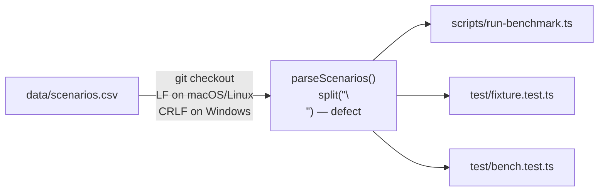

# Incident report: scenario CSV fails only on Windows CI

A reproducible-failure investigation: an environment-dependent defect that
passed on the development machine and Linux CI but failed on Windows CI,
traced to its root cause and fixed once at the shared parse boundary.

**Provenance.** This defect was deliberately introduced in commit
[`c5df027`](https://github.com/jordan-umpierre/delivery-routing-lab/commit/c5df02734eeddcbe1745064f558a8347274475b8)
as a controlled debugging exercise on a real defect class. Nothing else here
is staged: the CI failures, runs, commits, and investigation steps below
happened in the order shown, and every link points at the real artifact.

## Observed failure

Adding a Windows leg to the unit-test matrix
([issue #2](https://github.com/jordan-umpierre/delivery-routing-lab/issues/2))
produced a failure on `windows-latest` only
([failing run](https://github.com/jordan-umpierre/delivery-routing-lab/actions/runs/29609861693/job/87981736764)):

```
not ok 9 - committed scenario file parses and stays inside the KC graph
  error: 'scenarios: bad header "id,start,goal\r"'
```

In the plain job summary the rejected header printed as `id,start,goal` —
visually identical to the expected header. Only the structured TAP error
string exposed the trailing `\r`.

```json
{
  "environments": [
    {
      "os": "macOS local (Darwin arm64)",
      "node": "26.x",
      "checkoutEol": "LF",
      "result": "pass"
    },
    {
      "os": "ubuntu-latest",
      "node": "22.x",
      "checkoutEol": "LF",
      "result": "pass"
    },
    {
      "os": "windows-latest",
      "node": "22.x",
      "checkoutEol": "CRLF (core.autocrlf=true)",
      "result": "fail"
    }
  ]
}
```

## Minimal deterministic reproduction

No Windows machine needed — the environment difference reduces to one byte
sequence. On any platform:

```sh
perl -pi -e 's/\n/\r\n/' data/scenarios.csv   # what a Windows checkout does
npm test                                       # fails: bad header "id,start,goal\r"
git checkout data/scenarios.csv                # back to LF: passes
```

Or checkout the regression-test commit `484c478`, where the CRLF case is a
plain failing unit test.

## Hypothesis log (chronological)

1. **Windows path handling in `new URL("../data/scenarios.csv", import.meta.url)`?**
   Rejected: the sibling fixture test reads `data/kc-downtown.graph.json`
   with the identical pattern and passes on Windows.
2. **Node version or type-stripping difference between runners?**
   Rejected: both CI legs pin `setup-node` to Node 22 and every other test
   passes on the Windows leg.
3. **Line endings.** The TAP error string shows `"id,start,goal\r"`.
   Confirmed: the repository has no `.gitattributes`, the `windows-latest`
   image sets `core.autocrlf=true`, so git converts `data/scenarios.csv` to
   CRLF at checkout. `parseScenarios` split on `"\n"` only, leaving an
   invisible `\r` on the header and on the last field of every row, which
   the strict `/^\d+$/` validation correctly rejected. The graph JSON is
   unaffected because `JSON.parse` treats `\r` as whitespace.

## Root cause and affected paths



Every consumer routes through `parseScenarios` in `src/bench.ts`, so the
defect and the fix both live in exactly one place. Sibling audit: the only
other `split("\n")` in the repository operates on strings `toCsv` itself
produced with LF, so it cannot receive CRLF input. No temporary diagnostics
were added during the investigation, so none needed removing.

## Fix and verification

- Regression test first, failing at commit
  [`484c478`](https://github.com/jordan-umpierre/delivery-routing-lab/commit/484c478):
  `parseScenarios` must accept CRLF input.
- Root-cause fix at commit
  [`3b496f4`](https://github.com/jordan-umpierre/delivery-routing-lab/commit/3b496f4):
  split on `/\r?\n/` inside `parseScenarios`. At `484c478` the suite fails
  (1 failure); at `3b496f4` it passes (0 failures).
- Multi-environment verification:
  [green matrix run](https://github.com/jordan-umpierre/delivery-routing-lab/actions/runs/29609982346)
  on `ubuntu-latest` and `windows-latest`, plus the local CRLF simulation
  above on macOS.

**Why this boundary.** The parser is the trust boundary where this
repository already validates untrusted data strictly (like `loadGraph`), and
CRLF can arrive from editors and downloads, not just git normalization. A
`.gitattributes` rule would mask only the git path and leave the parser
fragile; fixing callers individually would leave sibling consumers broken.
Symptom-hiding options (setting `core.autocrlf=false` in CI, loosening the
validation regex) were rejected because they ignore or hide the defect
instead of removing it.
